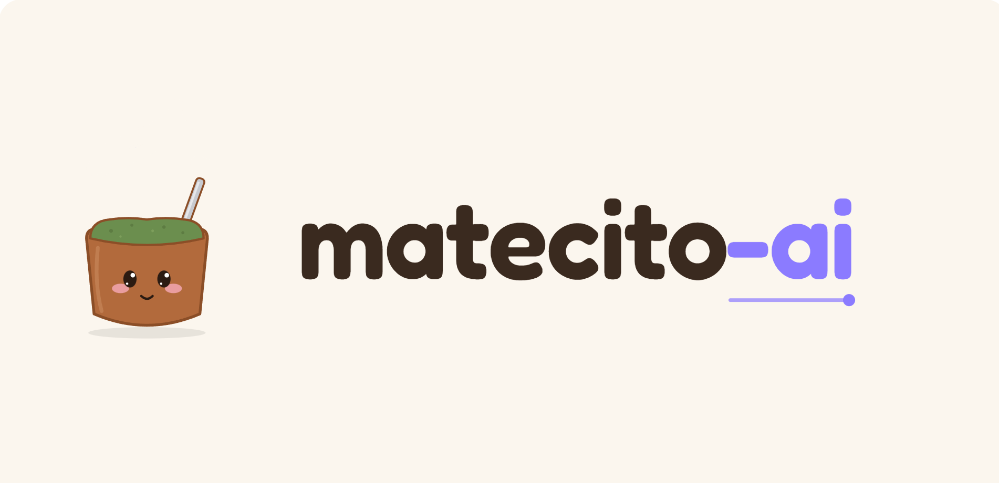

<p align="center">
  
</p>

<p align="center">
  <em>Mientras la IA trabaja por vos, te tomás unos ricos mates.</em>
</p>

<p align="center">
  <a href="#instalación"></a>
  
</p>

---

**matecito-ai** es un ecosistema de desarrollo asistido por IA, armado a medida sobre [Claude Code](https://claude.com/claude-code). No es una herramienta nueva: es la integración curada de varias piezas —propias y de terceros— en un flujo coherente, donde cada decisión de arquitectura queda registrada y respetada a lo largo del tiempo y entre sesiones.

La idea de fondo: que el agente **no reinvente las convenciones del proyecto en cada sesión**. Las decisiones se capturan una vez (como ADRs), se respetan al implementar, y la memoria de trabajo persiste vía Engram. El humano decide; la IA ejecuta dentro de esas decisiones.

## Qué hace

Trabajar con agentes de IA sobre un proyecto tiene tres fugas recurrentes, y matecito-ai ataca las tres:

- **Amnesia entre sesiones** → **Engram** persiste la memoria de trabajo (descubrimientos, contexto, fixes) entre sesiones.
- **Decisiones implícitas** → **ADRs** capturan las decisiones de arquitectura una vez; el flujo las respeta y avisa si algo las contradice.
- **Exploración cara** → **codegraph** indexa el código para explorarlo por estructura, sin escanear archivo por archivo.

Sobre eso corre un **flujo de desarrollo guiado (SDD)** que lleva cada cambio de un pedido en lenguaje natural hasta el código, pasando por fases con un punto de control humano al inicio.

## Componentes

| Capa        | Pieza                          | Rol                                                                                  |
|-------------|--------------------------------|--------------------------------------------------------------------------------------|
| **Skills**  | `project-decisions-bootstrap`  | Entrevista por fases que captura decisiones de ingeniería y las materializa como ADRs por dominio. |
| **Skills**  | `project-decisions-validate`   | Validador consultivo: coherencia, completitud y verificabilidad de los ADRs.         |
| **Skills**  | `SDD` *(fork del Gentleman)*   | Flujo de fases: intake → explore → propose → spec → design → tasks → apply → verify → archive. |
| **MCP**     | `codegraph`                    | Grafo de código pre-indexado (tree-sitter + SQLite) para explorar por estructura.    |
| **MCP**     | `context7`                     | Documentación de librerías al día, contra APIs no alucinadas.                        |
| **Agentes** | Sub-agentes del SDD            | Uno por fase, con contexto propio. Forkeados y modificados.                          |
| **Engram**  | Memoria persistente            | SQLite standalone con descubrimientos, contexto y fixes entre sesiones.              |

## El flujo SDD

```
intake → explore → propose → spec → design → tasks → apply → verify → archive
   │                                   │                          │
   │ estructura el pedido,             │ lee los ADRs vigentes    │ chequea que el código
   │ pregunta lo que falta,            │ y respeta los Accepted   │ respete los ADRs que tocó
   │ y FRENA para confirmar alcance    │                          │
```

- **intake** es la fase de entrada: hace 2-4 preguntas para estructurar el pedido, lo clasifica, y produce un brief. El orquestador **siempre muestra ese brief y espera tu confirmación** antes de seguir.
- **design** y **apply** leen los ADRs vigentes; **explore** usa codegraph; **apply** usa context7.
- **verify** confirma que el cambio no viole los ADRs que tocó.

## Instalación

Requisitos:
- Go `1.22+`
- [Claude Code](https://claude.com/claude-code) instalado y autenticado

Build local:

```bash
go build -o matecito-ai ./cmd/matecito-ai
```

## Uso

El CLI verifica, inicia e instala las dependencias del ecosistema (Engram, codegraph, context7) sobre Claude Code, y deploya el fork del SDD a `~/.claude/`. Una vez instalado, cada herramienta se usa con su propio binario; matecito-ai se ocupa del setup y la salud del entorno.

```bash
# Reportar estado del entorno (qué está instalado / registrado)
matecito-ai verify

# Diagnóstico accionable (qué falta y cómo arreglarlo)
matecito-ai doctor

# Instalar lo que falte (con backup de la config y confirmación)
matecito-ai install --dry-run
matecito-ai install

# Inicializar lo por-proyecto en el repo actual (ej: codegraph)
matecito-ai init
```

## Documentación

- [PRD](docs/PRD.md) — documento de producto del ecosistema.
